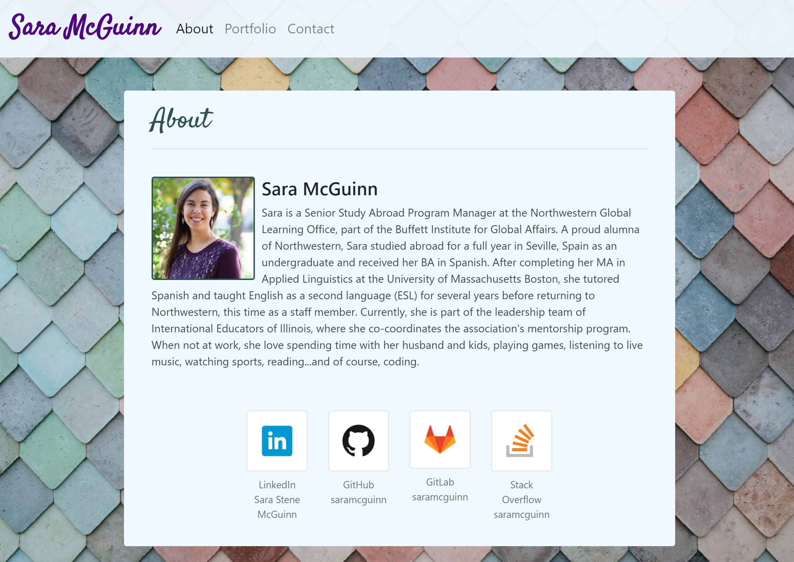

# portfolio

This website is my professional portfolio, including information about my background, links to my projects, and a contact me page.

Website url: https://saramcguinn.github.io/portfolio/

GitHub repo: https://github.com/saramcguinn/portfolio

This project was challenging and immensely instructive. Bootstrap is awesome in a lot of ways, but it's not a replacement for html or CSS knowledge. I'm feeling relatively comfortable with html, and while I have a long way to go with CSS, this project forced me to struggle through the necessary trial and error to get better at styling. It was especially challenging - and rewarding - to modify existing Bootstrap elements, such as the hamburger menu button.

Things from class that I incorporated into this project:
- Google Fonts
- Pseudoclasses
- Bootstrap grid & responsive layout
- Semantic html elements
- Organized CSS style sheet
- Adjusting margins, padding, opacity, colors, font size, etc. to get a reasonably nice-looking result

Things I learned:
- CSS properties "outline", "background image", "object-fit"
- CSS colors: https://www.rapidtables.com/web/color/blue-color.html
- How to position text over an image: https://www.w3schools.com/howto/howto_css_image_text.asp
- How to fill not stretch an image: https://stackoverflow.com/questions/11757537/css-image-size-how-to-fill-not-stretch 
- Pseudoclass workaround for having clicked a button: https://stackoverflow.com/questions/33621607/css-pseudo-class-for-having-clicked-on-a-button 

Things to practice/research further:
- Media queries - I did not have to use them in this assignment because Bootstrap did that work for me
- CSS layout & positioning in general
- CSS property "transform" & pseudoclass ":not"

